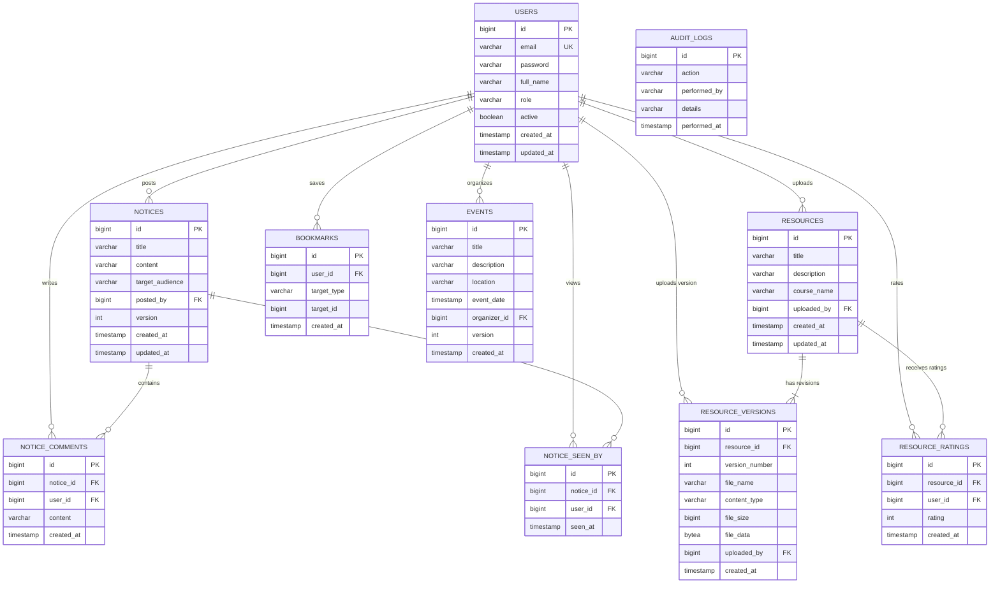

# 🎓 Campus Alliance (CampusConnect) — Complete Project Walkthrough & Technical Guide

---

## 📑 Table of Contents
1. [Executive Summary & High-Level Philosophy](#1-executive-summary--high-level-philosophy)
2. [Full System Architecture & Technical Stack](#2-full-system-architecture--technical-stack)
3. [Complete Directory & Project Structure Map](#3-complete-directory--project-structure-map)
4. [File-by-File Deep Dive Explanation](#4-file-by-file-deep-dive-explanation)
   - [A. Root & DevOps Configuration Files](#a-root--devops-configuration-files)
   - [B. Backend Application (`backend/src/main/java/com/campusalliance`)](#b-backend-application)
     - [1. Root & Configuration Packages (`config/`)](#1-root--configuration-packages)
     - [2. Security Infrastructure (`security/`)](#2-security-infrastructure)
     - [3. Domain Entities & Database Models (`entity/`)](#3-domain-entities--database-models)
     - [4. Data Transfer Objects (`dto/`)](#4-data-transfer-objects)
     - [5. Repository Layer (`repository/`)](#5-repository-layer)
     - [6. Business Logic Layer (`service/`)](#6-business-logic-layer)
     - [7. REST Controller Layer (`controller/`)](#7-rest-controller-layer)
     - [8. Exception Handling & Seeders (`exception/`, `seeder/`)](#8-exception-handling--seeders)
     - [9. Backend Resources & Unit Tests](#9-backend-resources--unit-tests)
   - [C. Frontend Application (`frontend/src/app`)](#c-frontend-application)
     - [1. Bootstrap & Core Configuration](#1-bootstrap--core-configuration)
     - [2. Authentication Module (`auth/`)](#2-authentication-module)
     - [3. Layout & Navigation Module (`layout/`)](#3-layout--navigation-module)
     - [4. Notices & Real-Time Broadcast Module (`notices/`)](#4-notices--real-time-broadcast-module)
     - [5. Academic Resources Module (`resources/`)](#5-academic-resources-module)
     - [6. Personal Bookmarks Module (`bookmarks/`)](#6-personal-bookmarks-module)
     - [7. Administrative Governance Module (`admin/`)](#7-administrative-governance-module)
     - [8. Infrastructure Diagnostics Module (`health/`)](#8-infrastructure-diagnostics-module)
5. [End-to-End Data Flows & Runtime Lifecycles](#5-end-to-end-data-flows--runtime-lifecycles)
6. [Database Schema & Entity-Relationship Architecture](#6-database-schema--entity-relationship-architecture)
7. [Security, Concurrency & High-Availability Mechanisms](#7-security-concurrency--high-availability-mechanisms)
8. [Local Development, Docker & Production Deployment](#8-local-development-docker--production-deployment)
9. [Interview, Viva & Technical Defense Preparation Guide](#9-interview-viva--technical-defense-preparation-guide)

---

## 1. Executive Summary & High-Level Philosophy

### What is Campus Alliance?
**Campus Alliance** (internally known as **CampusConnect**) is an enterprise-grade university portal built to unify academic collaboration, real-time campus broadcasting, multi-version document management, and administrative governance under a single, secure platform.

### Real-World Problems Solved
Traditional universities suffer from fragmented systems:
1. **Scattered Announcements**: Urgent exam schedules or circulars are lost in chaotic email threads or social messaging groups.
2. **Missing Document Versioning**: When syllabi or lecture slides are updated, students frequently download outdated or conflicting PDFs from scattered cloud drives.
3. **No Read-Receipt Analytics**: Faculty have no visibility into how many students have actually read critical exam or campus notices.
4. **Administrative Bottlenecks**: Managing user permissions, monitoring server health, and investigating audit trails are often separated into disparate, manual tools.

### Core Solution
Campus Alliance integrates:
- **Instant Push Broadcasting**: Server-Sent Events (SSE) stream live notices straight to connected student and faculty browsers without polling.
- **Git-like Document Revision Tracking**: Every resource re-upload creates a new immutable version while preserving the full download history.
- **Role-Based Access Control (RBAC)**: Fine-grained permissions across `STUDENT`, `FACULTY`, and `ADMIN` tiers.
- **Automated Health & Audit Monitoring**: Real-time HikariCP connection pool monitoring and an immutable chronological audit trail.

---

## 2. Full System Architecture & Technical Stack

```
┌────────────────────────────────────────────────────────────────────────┐
│                         CLIENT LAYER (Angular 18)                      │
│   ┌──────────────┐   ┌──────────────┐   ┌──────────────────────────┐   │
│   │ Authentication│   │ Live Notices │   │   Resource Repository    │   │
│   │ & RBAC Guards │   │ (SSE Stream) │   │ (Versioning & Ratings)   │   │
│   └───────┬──────┘   └──────┬───────┘   └────────────┬─────────────┘   │
│           │                 │                        │                 │
│           └─────────────────┴───────────┬────────────┘                 │
│                                HTTP / HTTPS & SSE                      │
└─────────────────────────────────────────┼──────────────────────────────┘
                                          │
┌─────────────────────────────────────────┼──────────────────────────────┐
│                      APPLICATION LAYER (Spring Boot 3.3)               │
│   ┌─────────────────────────────────────┴──────────────────────────┐   │
│   │                     Spring Security & JWT Filter               │   │
│   └─────────────────────────────────────┬──────────────────────────┘   │
│                                         │                              │
│   ┌─────────────────────────────────────┴──────────────────────────┐   │
│   │                          REST Controllers                      │   │
│   │   AuthController · NoticeController · ResourceController       │   │
│   │   UserManagementController · AuditLogController · SSEController│   │
│   └─────────────────────────────────────┬──────────────────────────┘   │
│                                         │                              │
│   ┌─────────────────────────────────────┴──────────────────────────┐   │
│   │                      Service & Business Logic                  │   │
│   │   HikariCP · JPA Auditing · Data Seeder · Actuator Probes      │   │
│   └─────────────────────────────────────┬──────────────────────────┘   │
└─────────────────────────────────────────┼──────────────────────────────┘
                                          │ JDBC (HikariCP)
┌─────────────────────────────────────────┼──────────────────────────────┐
│                       DATA LAYER (PostgreSQL 15)                       │
│   ┌─────────────┐   ┌─────────────┐   ┌─────────────┐   ┌──────────┐   │
│   │    Users    │   │   Notices   │   │  Resources  │   │  Audit   │   │
│   │   & Roles   │   │  & Comments │   │ & Versions  │   │   Logs   │   │
│   └─────────────┘   └─────────────┘   └─────────────┘   └──────────┘   │
└────────────────────────────────────────────────────────────────────────┘
```

### Technology Highlights

| Tier | Technology | Purpose |
|---|---|---|
| **Frontend** | Angular 18 (Standalone Components) | Single-page application with modular routing, Reactive Forms, and RxJS streams |
| **Styling** | Custom CSS Design System | Responsive layout with CSS variables, dark-mode accents, glassmorphism cards |
| **Backend** | Java 17 + Spring Boot 3.3.2 | High-throughput REST API and asynchronous event streaming |
| **Security** | Spring Security 6 + JJWT (`0.12.6`) | Stateless authentication using HMAC-SHA256 signed JSON Web Tokens |
| **Database** | PostgreSQL 15 (Neon Cloud / Local) | Relational persistence with ACID compliance, `@Lob` file storage, and optimistic locks |
| **ORM** | Spring Data JPA + Hibernate | Entity mapping, JPA Auditing, custom JPQL queries |
| **Realtime** | Server-Sent Events (`SseEmitter`) | Unidirectional server-to-client event streaming |
| **Observability** | Spring Boot Actuator + Micrometer | Production health checks, HikariCP connection pool metrics |
| **Deployment** | Docker, Vercel, Render | Multi-stage container builds and edge CDN routing |

---

## 3. Complete Directory & Project Structure Map

```
CampusConnect/
├── .gitignore
├── docker-compose.yml             # Local multi-container orchestration
├── README.md                      # High-level repo summary
├── PROJECT_WALKTHROUGH.md         # Full project technical walkthrough
│
├── backend/                       # Java / Spring Boot 3.3 Application
│   ├── Dockerfile                 # Multi-stage Maven build & JRE 17 runtime
│   ├── mvnw.cmd                   # Maven wrapper for Windows
│   ├── pom.xml                    # Project dependencies & plugin manifest
│   └── src/
│       ├── main/
│       │   ├── java/com/campusalliance/
│       │   │   ├── CampusAllianceApplication.java # Spring Boot entry point
│       │   │   ├── config/        # Security & JPA Auditing configurations
│       │   │   ├── controller/    # REST API endpoints (Auth, Notices, Resources, etc.)
│       │   │   ├── dto/           # Data Transfer Objects for requests and responses
│       │   │   ├── entity/        # JPA Database entities (User, Notice, Resource, etc.)
│       │   │   ├── exception/     # Global exception handler and custom exceptions
│       │   │   ├── repository/    # Spring Data JPA repositories
│       │   │   ├── security/      # JWT authentication filter, utils, UserDetails
│       │   │   ├── seeder/        # Initial database seeder for admin and demo users
│       │   │   └── service/       # Core business logic and transaction management
│       │   └── resources/
│       │       └── application.yml# Application properties (Datasource, JWT, Actuator)
│       └── test/java/com/campusalliance/service/ # Unit and integration tests
│
└── frontend/                      # Angular 18 Single-Page Application
    ├── angular.json               # Angular CLI configuration
    ├── Dockerfile                 # Multi-stage Node build & NGINX alpine runtime
    ├── package.json               # Node packages and NPM scripts
    ├── tsconfig.json              # TypeScript compiler configuration
    ├── vercel.json                # Single-Page-App URL rewrites for Vercel
    └── src/
        ├── index.html             # Main HTML landing template
        ├── main.ts                # Angular application bootstrap
        ├── styles.css             # Global CSS design system and theme styles
        ├── environments/          # Environment configuration (dev vs prod API URLs)
        └── app/
            ├── app.component.*    # Root shell component
            ├── app.config.ts      # App-wide providers (Router, HttpClient, Interceptor)
            ├── app.routes.ts      # Client-side route declarations and RBAC guards
            ├── auth/              # Authentication (Login, AuthService, Guards, Interceptor)
            ├── layout/            # Layout shell (Sidebar, Header, Profile display)
            ├── notices/           # Live notice feeds, SSE receiver, analytics, comments
            ├── resources/         # Academic repository, version viewer, rating system
            ├── bookmarks/         # Saved student items (notices & resources)
            ├── admin/             # User management, status toggle, audit log viewer
            └── health/            # Spring Actuator system health dashboard
```

---

## 4. File-by-File Deep Dive Explanation

---

### A. Root & DevOps Configuration Files

#### 1. `docker-compose.yml`
- **Purpose**: Defines a complete local multi-container environment so developers can boot the database, backend, and frontend with a single command (`docker-compose up --build`).
- **Services**:
  1. `postgres`: Runs official `postgres:15-alpine` on port `5432` with a persistent Docker volume (`postgres_data`).
  2. `backend`: Builds the Spring Boot application using `backend/Dockerfile`, injects PostgreSQL credentials via environment variables, and exposes port `8080`.
  3. `frontend`: Builds the Angular application using `frontend/Dockerfile` and serves production assets via NGINX on port `80`.

#### 2. `backend/Dockerfile`
- **Purpose**: Multi-stage Docker build for the Spring Boot backend.
- **Stage 1 (Builder)**: Uses `maven:3.9.6-eclipse-temurin-17-alpine` to copy `pom.xml` and `src/`, then executes `mvn clean package -DskipTests` to produce the executable JAR.
- **Stage 2 (Runtime)**: Uses lightweight `eclipse-temurin:17-jre-alpine`, copies only the compiled JAR file, exposes port `8080`, and sets the container entry point: `java -jar app.jar`. Keeps final image size minimal and secure.

#### 3. `frontend/Dockerfile`
- **Purpose**: Multi-stage Docker build for the Angular frontend.
- **Stage 1 (Builder)**: Uses `node:20-alpine`, runs `npm ci` followed by `npm run build` to generate static browser assets in `dist/`.
- **Stage 2 (Server)**: Uses `nginx:alpine`, copies the compiled static assets into `/usr/share/nginx/html`, and routes incoming HTTP traffic on port `80`.

#### 4. `frontend/vercel.json`
- **Purpose**: Configuration for hosting the Angular SPA on Vercel's global edge network.
- **Key Directive**: `"rewrites": [{ "source": "/(.*)", "destination": "/index.html" }]`. This ensures that when users refresh deep URLs (such as `/notices/1/analytics` or `/resources`), the request is redirected to `index.html` so Angular's client-side router can resolve the path instead of throwing a 404.

#### 5. `backend/pom.xml`
- **Purpose**: Maven Project Object Model file defining all Java dependencies and plugins.
- **Core Dependencies**:
  - `spring-boot-starter-web`: Exposes REST endpoints, Jackson JSON serializers, and Tomcat server.
  - `spring-boot-starter-data-jpa`: Hibernate ORM and Spring Data repositories.
  - `spring-boot-starter-security`: Spring Security 6 authentication framework.
  - `spring-boot-starter-validation`: Jakarta Bean Validation (`@NotBlank`, `@Email`, `@Min`, `@Max`).
  - `spring-boot-starter-actuator`: Health probes, server info, and connection pool metrics.
  - `postgresql`: JDBC driver to communicate with PostgreSQL databases.
  - `jjwt-api`, `jjwt-impl`, `jjwt-jackson` (`0.12.6`): Modern JSON Web Token library for parsing and signing tokens.
  - `lombok`: Boilerplate reduction for getters, setters, builders, and constructors.

---

### B. Backend Application

#### 1. Root & Configuration Packages

##### `CampusAllianceApplication.java`
- **Role**: Main bootstrap class annotated with `@SpringBootApplication`.
- **Execution**: Invokes `SpringApplication.run(CampusAllianceApplication.class, args)` to start the embedded Tomcat container, scan components, initialize Hibernate, and bind endpoints.

##### `config/SecurityConfig.java`
- **Role**: Central Spring Security 6 configuration.
- **Key Beans & Policies**:
  - `SecurityFilterChain`:
    - Disables CSRF (because the API is stateless and authenticates via Bearer JWT tokens in request headers).
    - Sets session creation policy to `SessionCreationPolicy.STATELESS`.
    - Configures public permit lists: `/api/auth/**`, `/api/sse/**`, and `/actuator/**`.
    - Restricts `/api/admin/**` exclusively to users with role `ADMIN`.
    - Requires authentication for all other endpoints (`anyRequest().authenticated()`).
    - Registers `JwtAuthenticationFilter` prior to `UsernamePasswordAuthenticationFilter`.
  - `CorsConfigurationSource`: Whitelists trusted origin patterns (`localhost`, `127.0.0.1`, `*.vercel.app`, `*.onrender.com`) and permits standard HTTP methods (`GET`, `POST`, `PUT`, `DELETE`, `PATCH`, etc.).
  - `PasswordEncoder`: Returns a `BCryptPasswordEncoder` bean for cryptographic password hashing.

##### `config/JpaAuditingConfig.java`
- **Role**: Enables Spring Data JPA auditing.
- **Function**: Annotated with `@Configuration` and `@EnableJpaAuditing`. Automatically populates `@CreatedDate` and `@LastModifiedDate` timestamps on entities inheriting from `Auditable`.

---

#### 2. Security Infrastructure

##### `security/JwtUtils.java`
- **Role**: Cryptographic helper for generating and validating JSON Web Tokens.
- **Key Methods**:
  - `generateToken(String email, String role)`: Signs an HMAC-SHA256 token containing the user's email as the subject, custom claims for `role`, creation timestamp, and an expiration timestamp (default: 24 hours).
  - `validateToken(String token)`: Parses the token against the application secret key; returns `false` if expired or tampered with.
  - `extractEmail(String token)` / `extractRole(String token)`: Retrieves claims from validated tokens.

##### `security/JwtAuthenticationFilter.java`
- **Role**: HTTP filter extending `OncePerRequestFilter`.
- **Workflow**:
  1. Intercepts incoming HTTP requests and inspects the `Authorization` header for `Bearer <token>`.
  2. If present and valid, extracts the email and loads the corresponding `UserDetails` via `CustomUserDetailsService`.
  3. Constructs a `UsernamePasswordAuthenticationToken` with authorities and binds it to `SecurityContextHolder.getContext().setAuthentication(...)`.
  4. Passes execution down the filter chain.

##### `security/CustomUserDetails.java`
- **Role**: Adapter that wraps the domain `User` entity to implement Spring Security's `UserDetails` interface.
- **Details**:
  - Maps `user.getRole()` to Spring Security's `GrantedAuthority` with a `ROLE_` prefix (e.g., `ROLE_STUDENT`, `ROLE_FACULTY`, `ROLE_ADMIN`).
  - Implements `isEnabled()` and `isAccountNonLocked()` based on `user.getActive()`, ensuring suspended users are blocked immediately.

##### `security/CustomUserDetailsService.java`
- **Role**: Service implementing `UserDetailsService`.
- **Function**: Implements `loadUserByUsername(String email)`, querying `UserRepository` and returning a `CustomUserDetails` instance.

---

#### 3. Domain Entities & Database Models

##### `entity/Auditable.java`
- **Role**: Base mapped superclass (`@MappedSuperclass`, `@EntityListeners(AuditingEntityListener.class)`).
- **Fields**:
  - `createdAt`: Populated automatically when a row is first inserted.
  - `updatedAt`: Updated automatically on every entity modification.

##### `entity/User.java` & `entity/Role.java`
- **Role**: Represents registered users across the institution.
- **Fields**:
  - `id`: Auto-incrementing primary key.
  - `email`: Unique institutional email address (e.g., `23051800@kiit.ac.in`).
  - `password`: BCrypt hashed string.
  - `fullName`: Student or faculty member's display name.
  - `role`: Enum (`STUDENT`, `FACULTY`, `ADMIN`), persisted as a readable string (`@Enumerated(EnumType.STRING)`).
  - `active`: Boolean flag (`true` by default). When set to `false`, the user is immediately suspended and rejected by security filters.

##### `entity/Notice.java`
- **Role**: Broadcast notices posted by faculty or administrators.
- **Fields**:
  - `id`, `title`, `content` (up to 5000 chars), `targetAudience` (e.g., "All Students", "Faculty Only").
  - `postedBy`: Foreign key to `User` (Lazy fetch).
  - `version`: `@Version Integer` used by Hibernate for optimistic concurrency control.
  - `seenByRecords`: One-to-Many relationship with `NoticeSeenBy` for read-receipt tracking.

##### `entity/NoticeComment.java`
- **Role**: Inquiry and discussion threads under specific notices.
- **Fields**: Foreign keys to `Notice` and `User`, `content` (up to 2000 chars), and audit timestamps.

##### `entity/NoticeSeenBy.java`
- **Role**: Tracks individual user read-receipts on notices.
- **Design**: Enforces a unique composite constraint across `(notice_id, user_id)` so each user can only mark a notice as seen once.

##### `entity/Resource.java`
- **Role**: Represents the logical container for an academic resource (e.g., "CS301 Operating Systems Lab Manual").
- **Fields**:
  - `title`, `description`, `courseName`, `uploadedBy` (User).
  - `versions`: One-to-Many collection of `ResourceVersion` sorted in ascending order by version number.

##### `entity/ResourceVersion.java`
- **Role**: Represents a specific revision/file upload of a resource.
- **Fields**:
  - `versionNumber`: Incremental integer (1, 2, 3...).
  - `fileName`: Original file name (e.g., `OS_Lab_Manual_v2.pdf`).
  - `contentType`: MIME type (e.g., `application/pdf`).
  - `fileSize`: File size in bytes.
  - `fileData`: `@Lob @Basic(fetch = FetchType.LAZY) byte[]` containing the raw binary data.
  - `uploadedBy`: Foreign key to the user who uploaded this specific version.

##### `entity/ResourceRating.java`
- **Role**: Peer rating system (1 to 5 stars) for materials.
- **Design**: Unique constraint on `(resource_id, user_id)` ensuring each user has one persistent rating per resource that they can update.

##### `entity/Bookmark.java`
- **Role**: User bookmarks for fast access to notices or resources.
- **Fields**: `user`, `targetType` (`NOTICE` or `RESOURCE`), `targetId`. Unique constraint on `(user_id, target_type, target_id)`.

##### `entity/Event.java`
- **Role**: Campus event listings (seminars, hackathons, guest lectures).
- **Fields**: `title`, `description`, `location`, `eventDate`, `organizer`, `@Version Integer version`.

##### `entity/AuditLog.java`
- **Role**: Immutable record of sensitive security and administrative actions.
- **Fields**: `action` (e.g., `USER_LOGIN`, `USER_SUSPENDED`, `RESOURCE_UPLOADED`), `performedBy` (email), `details`, `performedAt`.

---

#### 4. Data Transfer Objects (DTOs)

- `AuthResponse.java`: Returned upon successful login or registration; contains `token`, `email`, `fullName`, and `role`.
- `LoginRequest.java`: Ingests `email` and `password` with validation constraints.
- `RegisterRequest.java`: Ingests `fullName`, institutional `email`, `password`, and desired `role`.
- `UserDto.java`: Sanitized user representation omitting passwords for administrative listings.
- `NoticeRequest.java` & `NoticeDto.java`: DTOs for notice creation, updates (including `version`), and responses containing computed `seenCount` and `commentCount`.
- `NoticeCommentDto.java`: Serializes comment text, author name, and timestamps.
- `ResourceDto.java`: Encapsulates resource metadata, version count, average star rating, and total rating counts.
- `ResourceVersionDto.java`: File revision metadata (size, upload date, uploader, version number).
- `ResourceRatingDto.java`: Encapsulates rating scores and user names.
- `BookmarkDto.java`: Contains target type, target ID, titles, and creation dates.
- `EventRequest.java` & `EventDto.java`: DTOs for event creation and feeds.
- `AuditLogDto.java`: Serializes audit records for the administrative log dashboard.
- `ErrorResponse.java`: Standardized error payload structure (`status`, `message`, `timestamp`).

---

#### 5. Repository Layer

- `UserRepository.java`: Queries users by email (`findByEmail`), checks existence (`existsByEmail`), and filters active users.
- `NoticeRepository.java`: Retrieves notices ordered chronologically (`findAllByOrderByCreatedAtDesc`).
- `NoticeCommentRepository.java`: Fetches discussion comments ordered by creation date and calculates comment counts.
- `NoticeSeenByRepository.java`: Determines read counts (`countByNoticeId`) and checks if a user has seen a notice (`existsByNoticeIdAndUserId`).
- `ResourceRepository.java`: Features custom JPQL search (`searchByKeyword`) matching title, description, or course name case-insensitively.
- `ResourceVersionRepository.java`: Fetches version lists and locates the newest revision (`findTopByResourceIdOrderByVersionNumberDesc`).
- `ResourceRatingRepository.java`: Calculates real-time average ratings (`AVG(r.rating)`) and counts ratings per resource.
- `BookmarkRepository.java`: Manages user bookmarks and provides existence checks.
- `EventRepository.java`: Retrieves campus events ordered by event date.
- `AuditLogRepository.java`: Queries chronological audit entries and allows keyword searching across actions and emails.

---

#### 6. Business Logic Layer

##### `service/AuthService.java`
- **Registration**: Validates email uniqueness, verifies valid roles (`STUDENT` or `FACULTY`), prevents unauthorized self-registration as `ADMIN`, hashes the password with BCrypt, saves the user, writes an audit record (`USER_REGISTERED`), and returns a signed JWT.
- **Login**: Invokes Spring Security's `AuthenticationManager` to authenticate credentials. If successful, creates an audit log (`USER_LOGIN`) and returns the JWT token.

##### `service/NoticeService.java`
- **Create**: Builds and persists the `Notice` entity, creates an audit log, maps it to a `NoticeDto`, and pushes it to all live clients via `SseService.pushNotice(dto)`.
- **Update**: Performs optimistic concurrency checking. If another admin updated the record concurrently, Hibernate raises an `OptimisticLockException` (converted to HTTP 409).
- **Read Tracking**: `markAsSeen` checks if a record already exists; if not, inserts a new `NoticeSeenBy` row.

##### `service/SseService.java`
- **Mechanics**: Maintains a thread-safe `CopyOnWriteArrayList<SseEmitter>`.
- **Subscription**: When a client calls `/api/sse/notices`, creates an emitter with a 5-minute timeout. Binds cleanup hooks on completion, timeout, and errors.
- **Broadcasting**: Iterates over all active emitters and transmits `new-notice` SSE events. Automatically prunes disconnected client emitters upon `IOException`.

##### `service/ResourceService.java`
- **Create Resource**: Persists parent `Resource` row and simultaneously creates version 1 with the uploaded `MultipartFile` binary data.
- **Upload New Version**: Locates the latest version number, increments by 1, and inserts a new `ResourceVersion` row.
- **File Download**: Retrieves `ResourceVersion` by ID (or fetches latest). Returns original filename, MIME content type, and binary byte array.
- **Rating**: Records or updates a 1-5 star peer rating, triggering recalculation of the resource's aggregate average.

##### `service/UserManagementService.java`
- **User Governance**: Admin-only service to view all accounts and toggle user status between active and suspended.
- **Safeguard**: Prevents administrators from accidentally suspending their own active account.
- **Audit**: Generates `USER_ACTIVATED` or `USER_SUSPENDED` audit logs.

##### `service/BookmarkService.java`
- **Toggle**: Adds a bookmark if not present, removes it if already exists.
- **Aggregated View**: Fetches user's saved items and dynamically enriches each entry with the referenced notice or resource title.

##### `service/NoticeCommentService.java`
- Handles creation, retrieval, and deletion of comments under notices.

##### `service/EventService.java`
- Handles event creation, updates with optimistic locking, and chronological listing.

##### `service/AuditLogService.java`
- Centralized helper method `log(String action, String performedBy, String details)` that asynchronously saves audit trail records.

---

#### 7. REST Controller Layer

| Controller | Base Path | Key Endpoints | Access Control |
|---|---|---|---|
| `AuthController` | `/api/auth` | `POST /register`, `POST /login` | Public (`permitAll`) |
| `SseController` | `/api/sse` | `GET /notices` (SSE stream) | Public (`permitAll`) |
| `NoticeController` | `/api/notices` | `GET /`, `POST /`, `PUT /{id}`, `DELETE /{id}`, `POST /{id}/seen` | Authenticated; `POST`/`PUT` for Faculty/Admin; `DELETE` Admin only |
| `NoticeCommentController` | `/api/notices/{noticeId}/comments` | `GET /`, `POST /`, `DELETE /{commentId}` | Authenticated |
| `ResourceController` | `/api/resources` | `GET /`, `POST /` (Multipart), `POST /{id}/versions`, `GET /{id}/download`, `POST /{id}/rate` | Authenticated; `POST` for Faculty/Admin; `DELETE` Admin only |
| `BookmarkController` | `/api/bookmarks` | `GET /`, `POST /toggle`, `GET /check` | Authenticated |
| `EventController` | `/api/events` | `GET /`, `POST /`, `PUT /{id}`, `DELETE /{id}` | Authenticated; `POST`/`PUT` for Faculty/Admin |
| `UserManagementController` | `/api/admin/users` | `GET /`, `PUT /{id}/toggle-status`, `GET /stats` | Admin Only (`hasRole('ADMIN')`) |
| `AuditLogController` | `/api/admin/audit-logs` | `GET /`, `GET /search` | Admin Only (`hasRole('ADMIN')`) |

---

#### 8. Exception Handling & Seeders

##### `exception/GlobalExceptionHandler.java`
- **Role**: Central `@RestControllerAdvice` that intercepts all exceptions and returns uniform JSON `ErrorResponse` objects.
- **Handled Exceptions**:
  - `MethodArgumentNotValidException` ➔ `400 Bad Request` with joined validation failure messages.
  - `BadCredentialsException` ➔ `401 Unauthorized` ("Invalid email or password").
  - `DisabledException` / `LockedException` ➔ `403 Forbidden` ("Account has been suspended").
  - `OptimisticLockException` ➔ `409 Conflict` ("This record was modified by someone else. Please refresh.").
  - `ResourceNotFoundException` / `EntityNotFoundException` ➔ `404 Not Found`.
  - `Exception` (catch-all) ➔ `500 Internal Server Error` (logs internal stack trace server-side without leaking internals to the client).

##### `seeder/DataSeeder.java`
- **Role**: Executes on application startup (`CommandLineRunner`).
- **Initial Provisioning**:
  - Master Admin: `admin@university.edu` / `admin123`
  - Faculty Accounts: `dr.sharma@kiit.ac.in`, `prof.das@kiit.ac.in`, `dr.mukherjee@kiit.ac.in`
  - Student Accounts: `23051800@kiit.ac.in` through `23051806@kiit.ac.in`

---

### C. Frontend Application

---

#### 1. Bootstrap & Core Configuration

##### `frontend/src/main.ts`
- **Role**: Application entry point. Bootstraps `AppComponent` using `bootstrapApplication(AppComponent, appConfig)`.

##### `frontend/src/app/app.config.ts`
- **Role**: Application-level provider registry.
- **Provides**:
  - `provideRouter(routes)`: Configures client-side routing.
  - `provideHttpClient(withInterceptors([authInterceptor]))`: Configures Angular's HTTP client and registers the JWT interceptor.

##### `frontend/src/app/app.routes.ts`
- **Role**: Client-side route declarations with route guards.
- **Route Definitions**:
  - `/login`: Public login and registration component.
  - `/` (Layout wrapper protected by `authGuard`):
    - `/resources` ➔ `ResourceRepositoryComponent`
    - `/notices` ➔ `LiveNoticesComponent`
    - `/notices/:id/analytics` ➔ `NoticeAnalyticsComponent` (Guarded: `ADMIN`, `FACULTY`)
    - `/bookmarks` ➔ `BookmarksComponent`
    - `/health` ➔ `SystemHealthComponent` (Guarded: `ADMIN`)
    - `/admin/users` ➔ `UserManagementComponent` (Guarded: `ADMIN`)
    - `/admin/audit-logs` ➔ `AuditLogsComponent` (Guarded: `ADMIN`)

##### `frontend/src/environments/environment.ts` & `environment.development.ts`
- Defines backend API base URLs for production (`https://campusalliance.onrender.com`) and local development (`http://localhost:8080`).

---

#### 2. Authentication Module (`frontend/src/app/auth`)

##### `auth/auth.service.ts`
- Manages user authentication state via a reactive RxJS `BehaviorSubject<AuthResponse | null>`.
- Stores JWT token and user details in `localStorage`.
- Exposes convenience helpers: `getToken()`, `getRole()`, `getUserName()`, `getUserEmail()`, and `isLoggedIn()`.

##### `auth/auth.interceptor.ts`
- Functional HTTP interceptor.
- Clones every outgoing HTTP request and appends `Authorization: Bearer <token>` if a valid token exists in `localStorage`.

##### `auth/auth.guard.ts` & `auth/role.guard.ts`
- `authGuard`: Verifies the user is logged in; redirects unauthenticated requests to `/login`.
- `roleGuard`: Inspects route `data.roles`. If the current user's role does not match the permitted roles, redirects to `/resources`.

##### `auth/login/login.component.ts`
- Interactive tabbed interface allowing users to switch between Sign In and Sign Up.
- Enforces institutional email validation and displays error banners if login fails or if an account is suspended.

---

#### 3. Layout & Navigation Module (`frontend/src/app/layout`)

##### `layout/layout.component.ts`
- Application shell featuring a collapsible sidebar, breadcrumbs, user avatar badge, and dynamic navigation links that render based on the user's role.
- Contains the main `<router-outlet>` where child feature components are displayed.

---

#### 4. Notices & Real-Time Broadcast Module (`frontend/src/app/notices`)

##### `notices/notice.service.ts`
- Standard REST methods for notices (`getNotices`, `createNotice`, `deleteNotice`, `markAsSeen`).
- **SSE Listener** (`listenToLiveNotices`): Establishes a native browser `EventSource` connection to `${apiUrl}/api/sse/notices`. Listens for the `new-notice` event and triggers the callback to prepend new notices to the UI in real time.

##### `notices/live-notices/live-notices.component.ts`
- Real-time notice feed with interactive capabilities:
  - Auto-subscribes to the SSE stream on `ngOnInit` and unbinds on `ngOnDestroy`.
  - Expanding/collapsing long notice text.
  - One-click bookmarking.
  - Interactive discussion comments drawer.
  - Read-receipt tracking (`markAsSeen`).
  - Modal for publishing new targeted notices (Faculty & Admin).

##### `notices/notice-analytics/notice-analytics.component.ts`
- Visual analytics dashboard for faculty and administrators showing total views, student read percentages, and engagement metrics.

---

#### 5. Academic Resources Module (`frontend/src/app/resources`)

##### `resources/resource.service.ts`
- Handles multipart form data uploads for documents (PDF, DOCX, PPTX).
- Provides methods for multi-version downloads (`downloadFile`), retrieving revision history, and submitting peer ratings.

##### `resources/resource-repository/resource-repository.component.ts`
- Feature-rich academic repository with:
  - Real-time search across course codes, titles, and descriptions.
  - Interactive 5-star peer rating widget.
  - Version history modal showing all past revisions with individual download buttons.
  - Upload modal for publishing new materials or updating existing items with new versions.

---

#### 6. Personal Bookmarks Module (`frontend/src/app/bookmarks`)

##### `bookmarks/bookmark.service.ts` & `bookmarks/bookmarks.component.ts`
- Personal library view allowing students and faculty to view and organize all their saved notices and resources in one place.

---

#### 7. Administrative Governance Module (`frontend/src/app/admin`)

##### `admin/user-management/user-management.component.ts`
- User lifecycle management console for administrators:
  - Role-based statistics cards (Student count, Faculty count, Admin count).
  - Search by name or email, filter by role.
  - Instant account activation and suspension toggle with safety confirmation dialogs.

##### `admin/audit-logs/audit-logs.component.ts`
- Searchable security audit log viewer displaying action badges, user emails, timestamps, and contextual details.

---

#### 8. Infrastructure Diagnostics Module (`frontend/src/app/health`)

##### `health/system-health.service.ts` & `health/system-health.component.ts`
- Real-time system health dashboard querying Spring Boot Actuator:
  - Checks overall application status (`UP` / `DOWN`).
  - Evaluates PostgreSQL database connectivity and disk storage thresholds.
  - Visual gauge indicators for server latency and connection responsiveness.

---

## 5. End-to-End Data Flows & Runtime Lifecycles

### Flow 1: User Login & JWT Token Lifecycle

```
[User Browser]                 [AuthController]               [AuthService]            [DB / UserRepository]
      │                                │                             │                          │
      ├──── POST /api/auth/login ─────►│                             │                          │
      │     (email, password)          ├──── authService.login() ───►│                          │
      │                                │                             ├──── authenticate() ─────►│
      │                                │                             │    (BCrypt compare)      │
      │                                │                             ├◄─── User Entity ─────────┤
      │                                │                             ├──── AuditLogService.log()│
      │                                │                             ├──── jwtUtils.generate()  │
      │◄─── AuthResponse (JWT) ────────┴─────────────────────────────┴──────────────────────────┘
      │
[Store in localStorage]
      │
[Subsequent Request]
      ├──── GET /api/resources (Authorization: Bearer <JWT>) ───────► [JwtAuthenticationFilter]
                                                                            │ (Validate signature)
                                                                            ├─► Set SecurityContext
                                                                            └─► Controller execution
```

---

### Flow 2: Live Notice Broadcasting via Server-Sent Events (SSE)

```
[Student Browser]              [NoticeController]             [NoticeService]             [SseService]
      │                                │                             │                          │
      ├──── GET /api/sse/notices ──────────────────────────────────────────────────────────────►│ (Registers SseEmitter)
      │                                │                             │                          │
[Faculty Browser]                      │                             │                          │
      ├──── POST /api/notices ────────►│                             │                          │
      │    (title, content, audience)  ├──── createNotice() ────────►│                          │
      │                                │                             ├──── noticeRepo.save()    │
      │                                │                             ├──── sseService.push() ──►│
      │                                │                             │                          │
[SSE Stream: 'new-notice' Event] ◄─────────────────────────────────────────────────────────────┘
      │
[Prepend Notice to Live Feed]
```

---

### Flow 3: Resource Multi-Version Upload & Binary Download

```
[Faculty / Admin]              [ResourceController]          [ResourceService]           [PostgreSQL DB]
      │                                │                             │                          │
      ├─ POST /api/resources/{id}/ver ─►│                             │                          │
      │  (Multipart file binary)       ├─ uploadNewVersion() ───────►│                          │
      │                                │                             ├─ findTopByResourceId() ─►│ (find max version)
      │                                │                             ├─ save(ResourceVersion) ─►│ (version = 2, @Lob bytes)
      │◄─ ResourceVersionDto ──────────┴─────────────────────────────┴──────────────────────────┘

[Student]
      ├─ GET /api/resources/1/download?versionId=2 ─────────────────►│
                                                                     ├─ Fetch byte[] from DB ──►│
      │◄─ Binary Stream (Content-Type: application/pdf) ─────────────┴──────────────────────────┘
```

---

## 6. Database Schema & Entity-Relationship Architecture



---

## 7. Security, Concurrency & High-Availability Mechanisms

### 1. Optimistic Locking
- Entities such as `Notice` and `Event` use JPA's `@Version Integer version`.
- When two users attempt to edit the same notice concurrently, Hibernate compares the version column in the `WHERE` clause.
- The second update fails with `OptimisticLockException`, preventing silent data overwrites. The `GlobalExceptionHandler` converts this into an HTTP `409 Conflict` status with a user-friendly message.

### 2. Password Encryption
- Passwords are never stored in plaintext. They are salted and hashed using `BCryptPasswordEncoder` with a work factor of 10.

### 3. Account Suspension Enforcement
- When an administrator toggles an account status to inactive (`active = false`), `CustomUserDetails.isEnabled()` and `isAccountNonLocked()` immediately return `false`.
- Any subsequent API requests or login attempts by that user are rejected with HTTP `403 Forbidden`.

### 4. Memory-Efficient Binary Streaming
- File binary content in `ResourceVersion` uses `@Lob @Basic(fetch = FetchType.LAZY)`.
- Browsing resource lists or searching metadata does not load large files into memory. Byte arrays are only streamed when a user explicitly initiates a file download.

---

## 8. Local Development, Docker & Production Deployment

### Option 1: Docker Compose (All-in-One)
```bash
# Clone the repository
git clone https://github.com/Pritam16345/CampusAlliance.git
cd CampusAlliance

# Spin up Postgres, Backend, and Frontend containers
docker-compose up --build -d
```
- **Frontend Portal**: `http://localhost`
- **Backend API**: `http://localhost:8080/api`
- **Health Check**: `http://localhost:8080/actuator/health`

### Option 2: Manual Local Setup

#### Backend:
```bash
cd backend
# Requires PostgreSQL running locally on port 5432 (database: campusalliance)
./mvnw spring-boot:run
```

#### Frontend:
```bash
cd frontend
npm install
npm run start
# Runs on http://localhost:4200
```

---

## 9. Interview, Viva & Technical Defense Preparation Guide

### Q1: Why did you choose Server-Sent Events (SSE) over WebSockets for live notices?
> **Answer**: Notice broadcasting in a university portal is predominantly **unidirectional** (server to clients). WebSockets introduce bidirectional overhead and require stateful connection handshakes. SSE operates natively over standard HTTP/HTTPS, supports automatic browser reconnection out-of-the-box via `EventSource`, works smoothly through standard proxies and corporate firewalls, and requires significantly fewer server resources.

### Q2: How does the platform handle document version control?
> **Answer**: We separate the logical entity (`Resource`) from its physical revisions (`ResourceVersion`). The `Resource` entity holds course metadata, descriptions, and user ratings. Each re-upload adds a new row to `ResourceVersion` with an incremented `versionNumber` and the binary file data. This ensures full revision preservation, zero accidental file overwrites, and lets students download any historical version on demand.

### Q3: How is concurrency handled when multiple faculty members edit a notice simultaneously?
> **Answer**: We use **Optimistic Locking** via JPA's `@Version` annotation. The client sends the current version number with the update request. Hibernate issues `UPDATE notices SET ... WHERE id = ? AND version = ?`. If another user has updated the record in the interim, the version mismatch causes zero rows to be updated, throwing an `OptimisticLockException`. Our `GlobalExceptionHandler` converts this to an HTTP 409 Conflict, prompting the user to refresh and review changes.

### Q4: How is security implemented across different user roles?
> **Answer**: We use stateless **JWT authentication** combined with Spring Security 6. Each token contains the user's role in its claims. The `JwtAuthenticationFilter` validates the signature and populates the `SecurityContext`. Endpoints are protected via `@PreAuthorize("hasRole('ADMIN')")` or method security rules, and Angular routes are protected on the client side using `roleGuard` and `authGuard`.

---

<div align="center">
  <sub>Campus Alliance © 2026. Designed for Modern University Collaboration.</sub>
</div>
